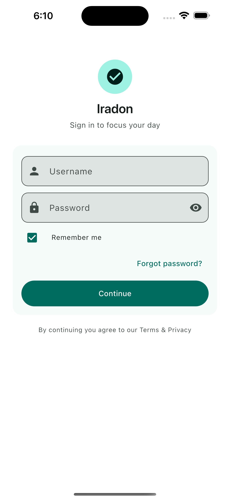
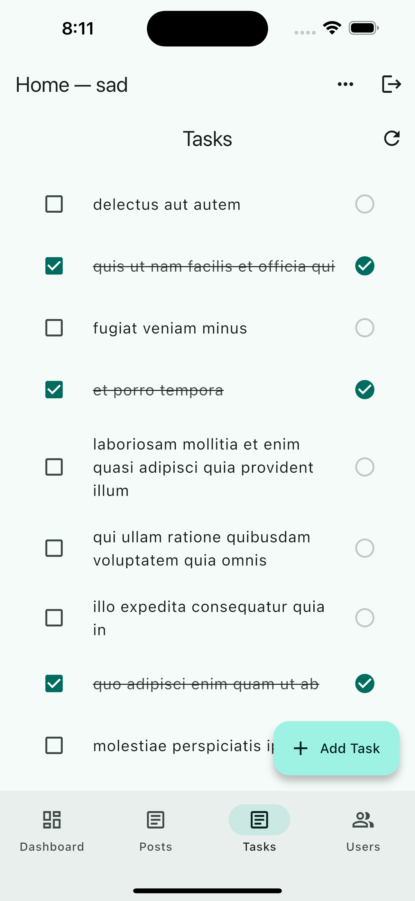
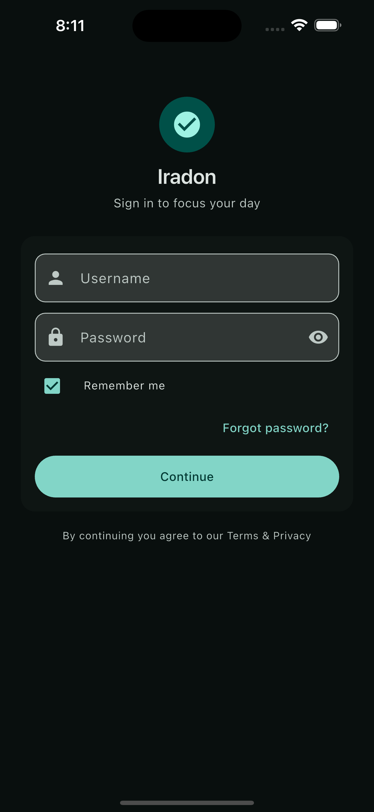

# 📱 Iradon

[](https://github.com/saadyousafmalhi/flutter/releases/latest)


**Iradon** — a modern productivity app built with Flutter.  
Manage tasks, goals, and intentions with **clean architecture, Material 3 theming, and automated CI/CD pipelines**.

👉 [Download the latest APK](https://github.com/saadyousafmalhi/flutter/releases/latest)


---

## ✨ Features
- 🔐 **Authentication** with persisted sessions (login/logout flow)
- ✅ **Task Feed** (list view, pull-to-refresh, error handling)
- 🎨 **Material 3 Theming** with brand colors (teal/orange) & light/dark mode
- 📖 **Knowledge Base** (help screen reframed from cheat sheet)
- 💾 **Persistence** with SharedPreferences (remembers user state & theme)
- ⚡ **CI/CD** with GitHub Actions (signed APK/AAB published on every tagged release)

---

## 📸 Screenshots


<p align="center">
  
  
  
</p>

---

## 🏗️ Architecture Overview


- **State Management:** Provider (AuthProvider, TaskProvider)  
- **Persistence:** SharedPreferences  
- **UI:** Material 3, theming with ColorScheme.fromSeed  
- **Navigation:** RootGate + persistent tabs with AutomaticKeepAliveClientMixin  

---

## 🛠️ Tech Stack
- [Flutter](https://flutter.dev/) (3.x, Material 3)
- [Provider](https://pub.dev/packages/provider) for state management
- [SharedPreferences](https://pub.dev/packages/shared_preferences) for persistence
- [GitHub Actions](https://github.com/features/actions) for CI/CD

---

## 🚀 Getting Started

### Prerequisites
- [Flutter SDK](https://docs.flutter.dev/get-started/install)
- Android Studio / Xcode (emulator or real device)

### Run locally
```bash
flutter pub get
flutter run
```
## 🏗️ Build Release

```bash
flutter build apk --release
flutter build appbundle --release

##🔄 CI/CD

CI Workflow → Runs analyzer + tests on every push

CD Workflow → On main or when tagging v*, builds signed APK & AAB and attaches them to GitHub Releases

## 📜 License
This project is licensed under the MIT License.