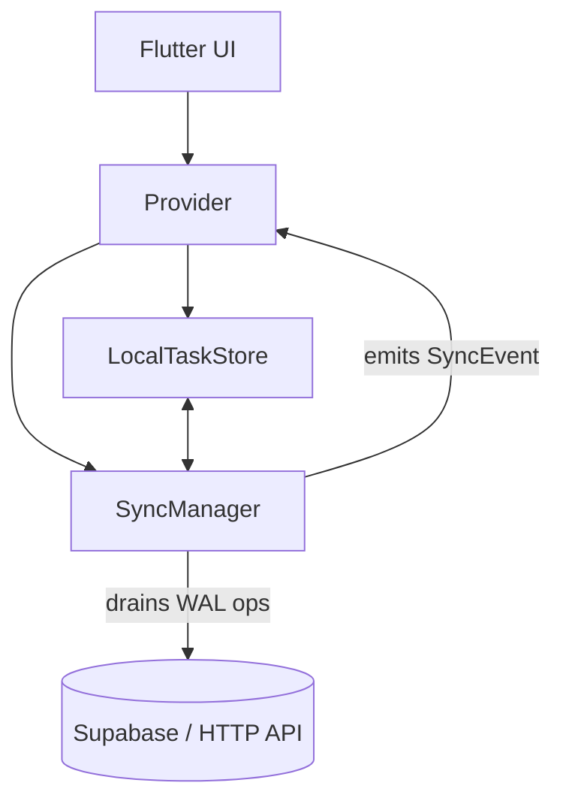

# Iradon – Offline-First Task Manager (Flutter)

Iradon is a **task manager app built with Flutter** that explores resilient, offline-first design patterns.  
The goal is not just to make another todo app, but to **demonstrate how to build mobile apps that work reliably with poor or intermittent networks**.

---

## ✨ Key Features

- **Offline-first architecture** using a Write-Ahead Log (WAL)
- **SyncManager** with exponential backoff, retry, and event emission
- **Live SyncEvents** → TaskProvider updates the UI instantly when an op commits
- **Temp → Real ID reconciliation** (optimistic tasks never disappear or duplicate)
- **Provider-based state management** with `LocalTaskStore` persistence
- **Pull-to-refresh** drains the queue first, then overlays pending items so nothing vanishes

---

## 🏗 Architecture

### Data Flow
1. User creates a task offline → stored in `LocalTaskStore` with a negative **temp ID** + enqueued in WAL.
2. `SyncManager` drains the WAL when online, sending the create/update/delete to the server.
3. After persistence, `SyncManager` emits a **SyncEvent** (e.g., `CreateCommitted`).
4. `TaskProvider` listens and updates in-memory state → UI reflects the change instantly.
5. During refresh, pending optimistic tasks are **overlaid** on server fetches, so tasks never disappear.

---

## 🚀 What’s New (v1.0.0+16)

- Added **`SyncEvent` stream** in `SyncManager`
- `TaskProvider` now subscribes to events → instant UI updates, no manual refresh needed
- Overlay logic during `load(force:true)` keeps optimistic items visible when refreshing
- MultiProvider wiring improved:
  - `AuthProvider → SyncManager → TaskProvider`

---

## 🔑 Why It Matters

- **No disappearing tasks:** even if you refresh immediately after going back online.
- **Smooth UX:** temp IDs swap to real IDs the moment the server confirms.
- **Resilient design:** WAL + backoff ensures actions are never lost, even across app restarts.
- **Real-world ready:** demonstrates patterns used in production-grade apps.

---

## 📦 Tech Stack

- Flutter 3 (Material 3 theming)
- Provider for state management
- Supabase (auth + backend API)
- Local persistence via `SharedPreferences` (abstracted in `LocalTaskStore`)

---

## 🔮 Roadmap

- Conflict resolution (multiple device sync)
- UI indicators for “syncing” vs “committed”
- Unit tests for WAL + SyncManager
- CI/CD with GitHub Actions for tagged releases

---

## 📂 Repo

👉 [github.com/saadyousafmalhi/flutter](https://github.com/saadyousafmalhi/flutter)

---
# Iradon – Offline-First Task Manager (Flutter)

Iradon is a **task manager app built with Flutter** that explores resilient, offline-first design patterns.  
The goal is not just to make another todo app, but to **demonstrate how to build mobile apps that work reliably with poor or intermittent networks**.

---

## ✨ Key Features

- **Offline-first architecture** using a Write-Ahead Log (WAL)
- **SyncManager** with exponential backoff, retry, and event emission
- **Live SyncEvents** → TaskProvider updates the UI instantly when an op commits
- **Temp → Real ID reconciliation** (optimistic tasks never disappear or duplicate)
- **Provider-based state management** with `LocalTaskStore` persistence
- **Pull-to-refresh** drains the queue first, then overlays pending items so nothing vanishes

---

## 🏗 Architecture

### Data Flow
1. User creates a task offline → stored in `LocalTaskStore` with a negative **temp ID** + enqueued in WAL.
2. `SyncManager` drains the WAL when online, sending the create/update/delete to the server.
3. After persistence, `SyncManager` emits a **SyncEvent** (e.g., `CreateCommitted`).
4. `TaskProvider` listens and updates in-memory state → UI reflects the change instantly.
5. During refresh, pending optimistic tasks are **overlaid** on server fetches, so tasks never disappear.

---

## 🚀 What’s New (v1.0.0+16)

- Added **`SyncEvent` stream** in `SyncManager`
- `TaskProvider` now subscribes to events → instant UI updates, no manual refresh needed
- Overlay logic during `load(force:true)` keeps optimistic items visible when refreshing
- MultiProvider wiring improved:
  - `AuthProvider → SyncManager → TaskProvider`

---

## 🔑 Why It Matters

- **No disappearing tasks:** even if you refresh immediately after going back online.
- **Smooth UX:** temp IDs swap to real IDs the moment the server confirms.
- **Resilient design:** WAL + backoff ensures actions are never lost, even across app restarts.
- **Real-world ready:** demonstrates patterns used in production-grade apps.

---

## 📦 Tech Stack

- Flutter 3 (Material 3 theming)
- Provider for state management
- Supabase (auth + backend API)
- Local persistence via `SharedPreferences` (abstracted in `LocalTaskStore`)

---

## 🔮 Roadmap

- Conflict resolution (multiple device sync)
- UI indicators for “syncing” vs “committed”
- Unit tests for WAL + SyncManager
- CI/CD with GitHub Actions for tagged releases

---

## 📂 Repo

👉 [github.com/saadyousafmalhi/flutter](https://github.com/saadyousafmalhi/flutter)

---
