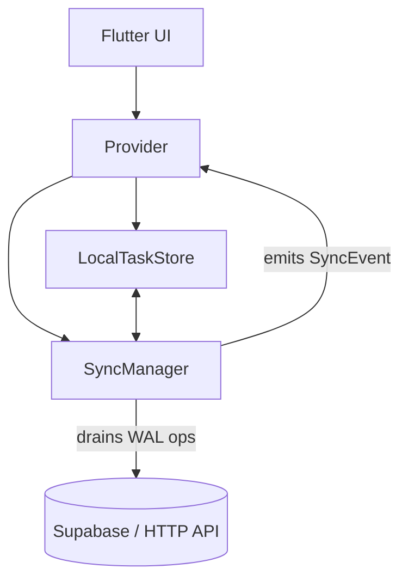

# Iradon – Offline-First Task Manager (Flutter)

Iradon is a **task manager app built with Flutter** that explores resilient, offline-first design patterns.  
The goal is not just to make another todo app, but to **demonstrate how to build mobile apps that work reliably with poor or intermittent networks**.

---

## ✨ Core Capabilities

- Offline-first task creation with **Write-Ahead Log (WAL)**
- **SyncManager** with retries, exponential backoff, and event-driven updates
- **SyncEvents** → `TaskProvider` updates the UI instantly when ops commit
- **Temp → Real ID reconciliation** (optimistic tasks never disappear or duplicate)
- **Provider + LocalTaskStore persistence** for smooth offline/online experience
- Pull-to-refresh drains the WAL first, then overlays pending items so nothing vanishes

---

## 🏗 Architecture

### Data Flow
1. User creates a task offline → stored in `LocalTaskStore` with a negative **temp ID** + enqueued in WAL.  
2. `SyncManager` drains the WAL when online, sending the create/update/delete to the server.  
3. After persistence, `SyncManager` emits a **SyncEvent** (e.g., `CreateCommitted`).  
4. `TaskProvider` listens and updates in-memory state → UI reflects the change instantly.  
5. During refresh, pending optimistic tasks are **overlaid** on server fetches, so tasks never disappear.

---

## 🔑 Why It Matters

- **Seamless UX:** tasks stay visible and update instantly, even during network transitions.  
- **Reliable sync:** WAL ensures no action is lost, even if the app crashes or restarts.  
- **Real-world ready:** models production-grade offline-first patterns in Flutter.  

---

## 📦 Tech Stack

- Flutter 3 (Material 3 theming)  
- Provider for state management  
- Supabase (auth + backend API)  
- Local persistence via `SharedPreferences` (abstracted in `LocalTaskStore`)  

---

## 🔮 Roadmap

- Conflict resolution for multi-device sync  
- UI indicators for “syncing” vs “committed”  
- Unit tests for WAL + SyncManager  
- CI/CD with GitHub Actions for tagged releases  

---

## 📂 Repo

👉 [github.com/saadyousafmalhi/flutter](https://github.com/saadyousafmalhi/flutter)

---
