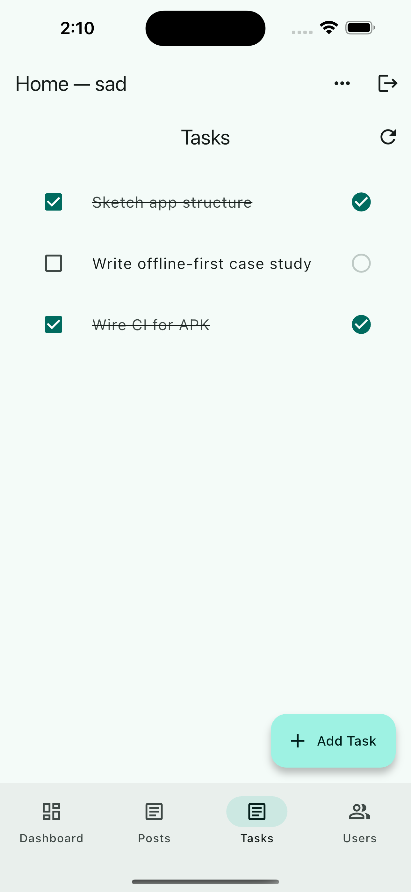

# 📱 Iradon

[](https://github.com/saadyousafmalhi/flutter/releases/latest)

# Iradon – Offline-First Task Manager in Flutter  

**Iradon** is a Flutter application designed as an **engineering case study in offline-first architecture**.  
It demonstrates how to combine **local persistence, write-ahead logging (WAL), and sync management** to deliver a seamless user experience in unreliable network conditions.  

👉 [Download the latest APK](https://github.com/saadyousafmalhi/flutter/releases/latest)

---

## 📸 Screenshots

<p align="center">
  
  
  
</p>

---

## ✨ Core Capabilities

- Offline-first task creation with **Write-Ahead Log (WAL)**
- **SyncManager** with retries, exponential backoff, and event-driven updates
- **SyncEvents** → `TaskProvider` updates the UI instantly when ops commit
- **Temp → Real ID reconciliation** (optimistic tasks never disappear or duplicate)
- **Provider + LocalTaskStore persistence** for smooth offline/online experience
- Pull-to-refresh drains the WAL first, then overlays pending items so nothing vanishes

---

## 🏗️ Architecture


### Data Flow
1. User creates a task offline → stored in `LocalTaskStore` with a negative **temp ID** + enqueued in WAL.  
2. `SyncManager` drains the WAL when online, sending the create/update/delete to the server.  
3. After persistence, `SyncManager` emits a **SyncEvent** (e.g., `CreateCommitted`).  
4. `TaskProvider` listens and updates in-memory state → UI reflects the change instantly.  
5. During refresh, pending optimistic tasks are **overlaid** on server fetches, so tasks never disappear.

---

## 🔑 Why It Matters

- **Seamless UX:** tasks stay visible and update instantly, even during network transitions.  
- **Reliable sync:** WAL ensures no action is lost, even if the app crashes or restarts.  
- **Real-world ready:** models production-grade offline-first patterns in Flutter.  

---

## 📦 Tech Stack

- Flutter 3 (Material 3 theming)  
- Provider for state management  
- Supabase (auth + backend API)  
- Local persistence via `SharedPreferences` (abstracted in `LocalTaskStore`)  

---

## 🚀 Getting Started

### Prerequisites
- [Flutter SDK](https://docs.flutter.dev/get-started/install)
- Android Studio / Xcode (emulator or real device)

### Run locally
```bash
flutter pub get
flutter run
```

---

## 🏗️ Build Release

```bash
flutter build apk --release
flutter build appbundle --release
```

---

## 🔄 CI/CD

- **CI Workflow** → runs analyzer + tests on every push  
- **CD Workflow** → on `main` or when tagging `v*`, builds signed APK & AAB and attaches them to GitHub Releases  

---

## 📜 Changelog

See [CHANGELOG.md](./CHANGELOG.md) for detailed release history.

---
